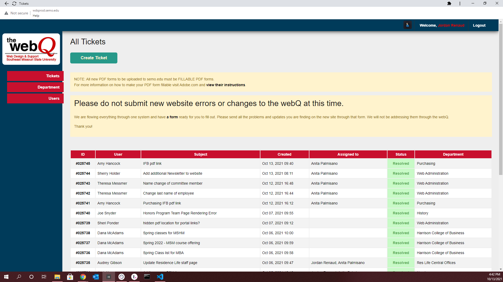
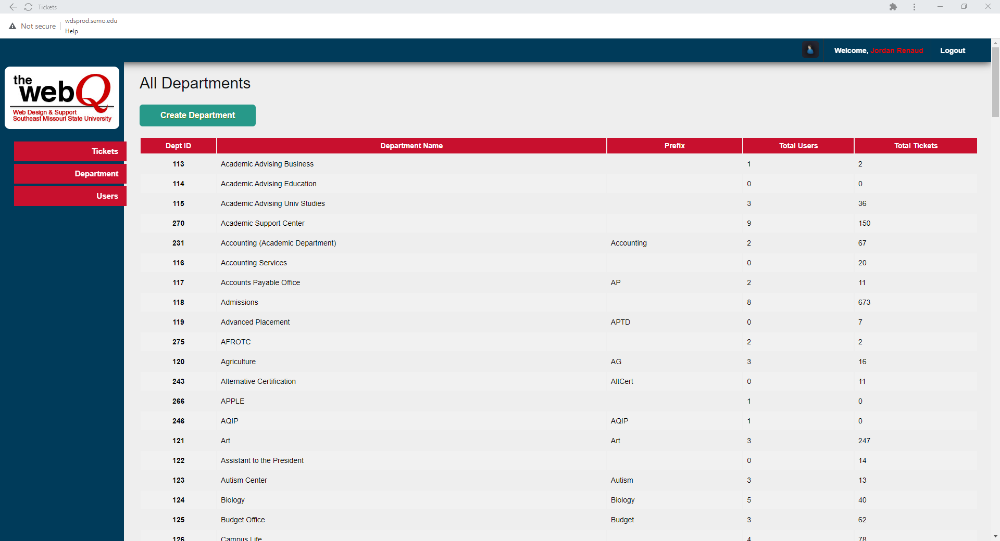
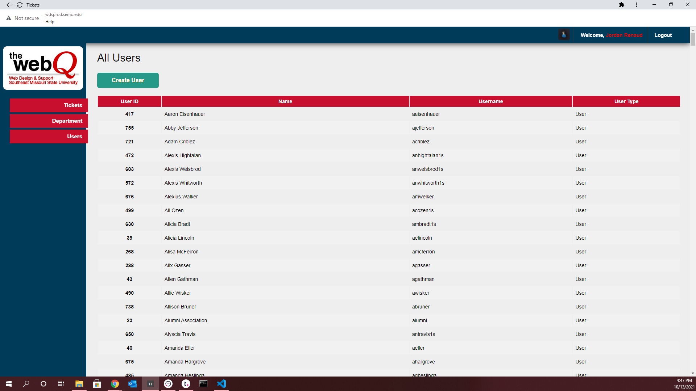
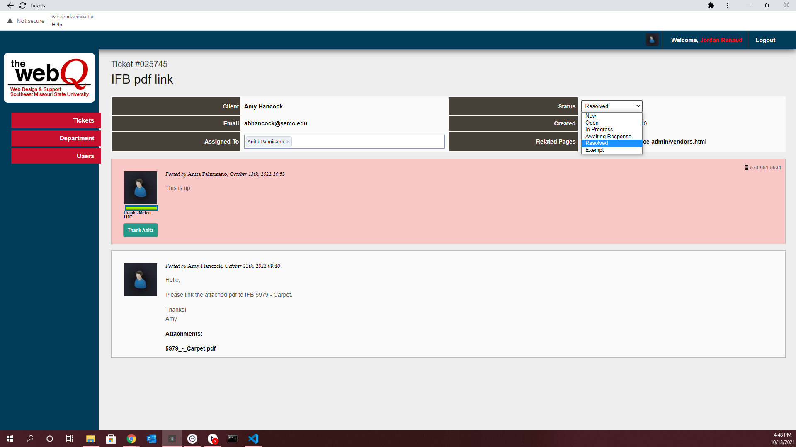
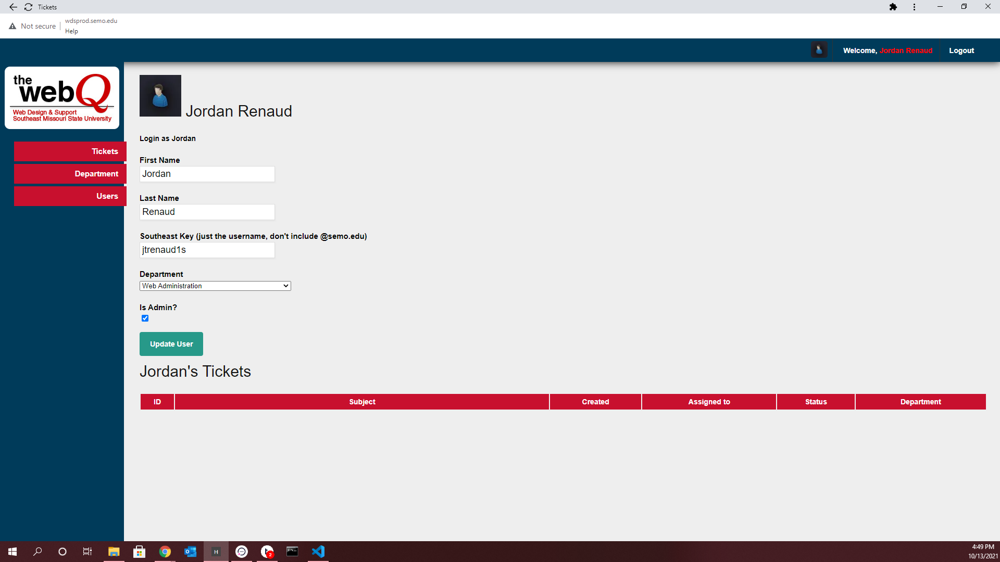

# Ticket Support System Backend

Nest.js Backend
No Database Selected
Prisma ORM

✔ Your Prisma schema was created at prisma/schema.prisma. You can now open it in your favorite editor.

warn You already have a .gitignore. Don't forget to exclude .env to not commit any secret.

Next steps:
1. Set the DATABASE_URL in the .env file to point to your existing database. If your database has no tables yet, read https://pris.ly/d/getting-started
2. Set the provider of the datasource block in schema.prisma to match your database: postgresql, mysql, sqlite, sqlserver (Preview) or mongodb (Preview).
3. Run prisma db pull to turn your database schema into a Prisma schema.
4. Run prisma generate to generate the Prisma Client. You can then start querying your database.

More information in our documentation:
https://pris.ly/d/getting-started

### Main Ticket Page

  

### Department Listing Page

  

### User Listing Page

  

### Ticket Detail Page

  

# Ticket Detail Page Version 2

  

### User Profile Page

  

